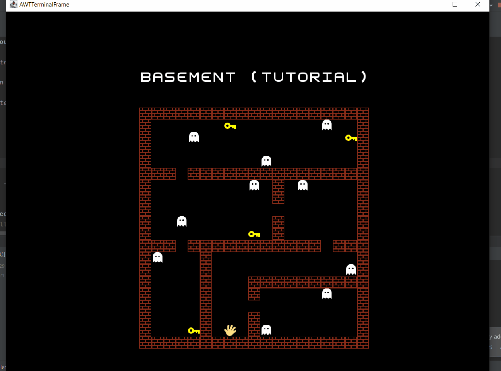

# lpoo-2021-g11 - Escape the Mansion

"Escape the Mansion" is a puzzle-strategy game where the player is trapped in a haunted mansion.
In order to win, the player must escape it while running from ghosts and collecting various items to unlock
all the levels (represented by floors).

Our idea was inspired by *Escape Room* games and also the game *Luigi's Mansion*.

This project was developed by Ana Matilde Barra (up201904795@fe.up.pt), Ângela Coelho (up201907549@fe.up.pt) and Nuno Castro (up202003324@fe.up.pt) for LPOO 2020⁄21.

### Gif displaying the current state of the game

