# LPOO_11 - Escape the Mansion

"Escape the Mansion" is a puzzle-strategy game where the player is trapped in a haunted mansion.
In order to win, the player must escape it while running from ghosts and collecting various items to unlock
all the levels (represented by floors).

Our idea was inspired by *Escape Room* games and also the game *Luigi's Mansion*.

This project was developed by Ana Matilde Barra (up201904795@fe.up.pt), Ângela Coelho (up201907549@fe.up.pt) and Nuno Castro (up202003324@fe.up.pt) for LPOO 2020⁄21.

## Implemented Features

#### Player Movement: 
- The player can be moved with the arrow keys (up, down, left, right) and jump in a specific direction with WASD.
- In the options menu we can choose what is the type of keys we want to use to jump (Arrow keys or WASD).

#### Graphic Interface:
- At the moment, we have implemented the graphic interface Lanterna, which allows us to draw all our elements;
- We now have several menus: "Menu", "Pause", "Options", "GameOver" and "Level Complete", each one with its diferent options to select.
- The game can only be closed trough the Menu option "Quit" - the window is closed and the process terminates successfully.  
- The game map is viewed from the top;
- The map is loaded from a *.map file.

#### Elements:
- Player (movable element that we control);
- Wall (unmovable element that cannot be crossed through);
- Ghost (represents an enemy, with random movements);
- Key (unmovable element that represents the clues to collect, not yet collectable);
- Door (unmovable element that is eliminated trough the collection of a key - "the doors can be opened");
- Box (movable element - "the boxes move if we push them");
- EndLevel (unmovable element that represents the end of a Level - only visible when all the keys are collected and therefore all the doors are open). 
- Collisions between elements.

### Gif
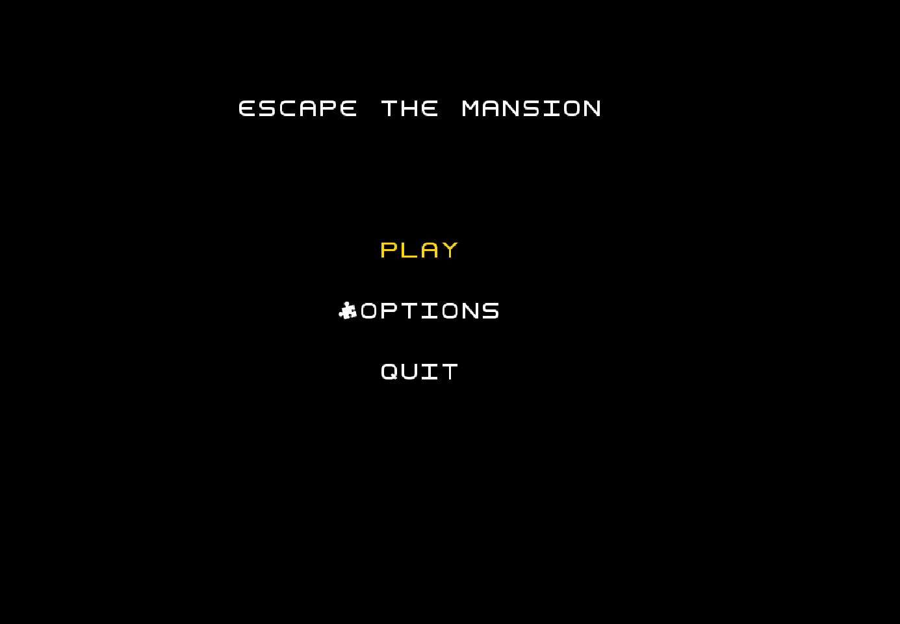

## Planned Features

#### Map Related :

- [x]  Top-view of the map; 
  
- [x] Mansion with different floors (our levels) each with a different floor-plan (different rooms). This leads to the existence of doors to open with the clues/items collected (in the beginning only the door to the 1st room is open);
  
- [ ] To opens the last door of the floor and be able to go "up", the player needs to solve a final riddle with all the collected clues until that point;

- [x] Holes on the ground;

- [ ] Each "repeated" level may have its map randomly generated so that each time the same level is played, the story reamins the same but the items are in different places;

- Levels to implement (different lighting, number of ghosts, type of enemy):
    - [x] Basement - Tutorial, has lighting - teach the controls and the mechanics of the game;
    - [x] 1st floor - 'easy' level, solve the first puzzle, 5 ghosts, light in the whole level - IN PROGRESS;
    - [ ] 2nd floor - 'medium' level, solve a trickier puzzle, more ghosts (8?), light in half the level;
    - [ ] Attic - 'hard' level, to solve the hardest puzzle the player will have to fight a ghost BigBoss (the owner of the mansion?), stronger than all the other ghosts;
    - [ ] Patio - find a hidden key and open the final gate, show the final credits and then open a level “hub” - so that we can repeat the levels we want by any order.

#### Item related:

- [x] Collect Clues/Catch items (keys, flashlights, weapons);

- [ ] Clues with text/numbers on screen;

- [ ] Different vision field in accordance to the flashlight equiped;

- [ ] Turn the flashlight on or off with a keystroke on a specific keyboard key;

- [ ] Items 'shop' in the 'elevator' between different mansion levels - to buy flashlight improvements, new weapons, new flashlight batteries;

- [ ] 'Potions' to reset the normal levels of fear (0), life (100) and flashlight battery (100) (names: courage, life, newBatteries, etc) - some stronger than the others;

- [ ] Each weapon has a damage value;

- [ ] Attack with a click on the left button of the mouse

- [ ] Each Flashlight has an intensity (quantity of light), a battery and a damage value associated; (light only damages the 'small' ghosts)

#### Element related:

- [x] Move obstacles (boxes, furniture) to clear paths;

- [ ] Defeat/Catch ghosts (score bonus);

- [x] Limit time to escape;

- [ ] Calculate the final level score with the time that it takes to leave the level and the number of ghosts defeated

- [x] Life, Fear and battery meters, clues collected counter and ghosts defeated counter - this last one is still not done;

- [ ] When the fear level is above 75, the damage inflicted by ghost attacks is bigger and, because of that our player loses more life and moves slower;

- [ ] Character Inventory - to check the collected clues again;

- [x] Our Player can jump two "cases" - over holes on the floor - with the keys selected in the options menu

- [ ] Dialogs - with the boss and inside the players mind.

### Mockups

- Menu    
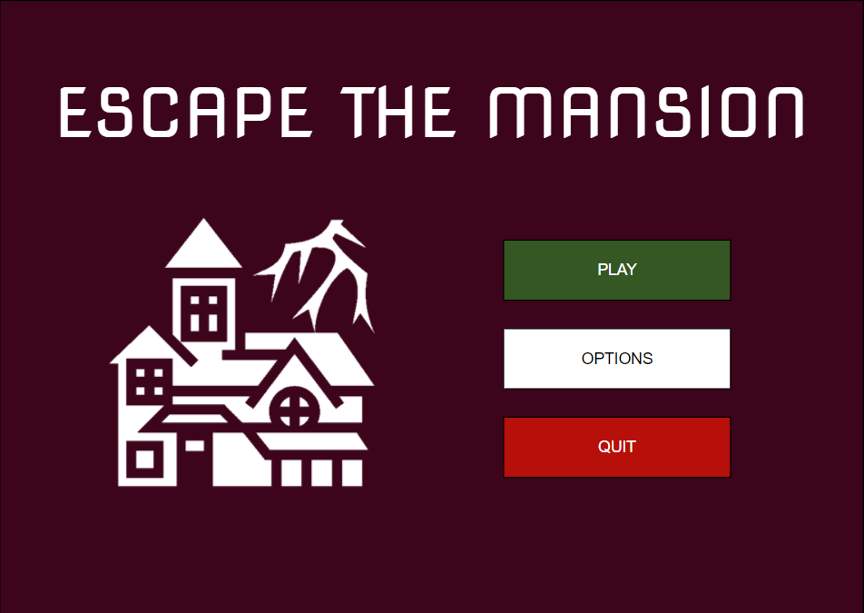

- Level    
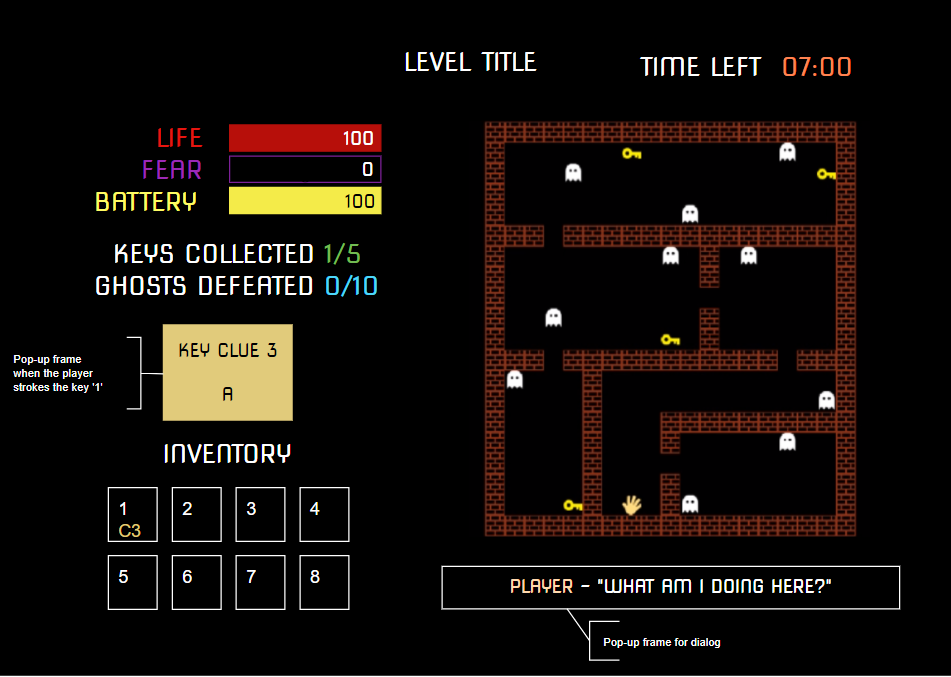

- Pause     
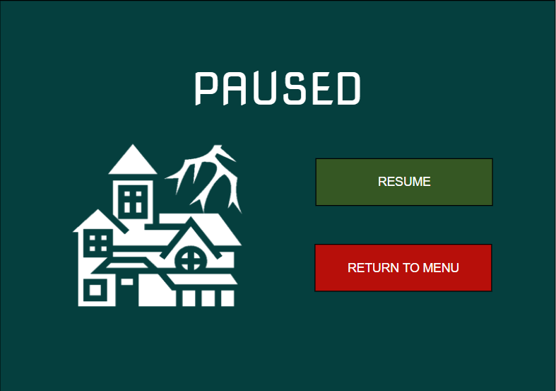

- Solve the Puzzle    
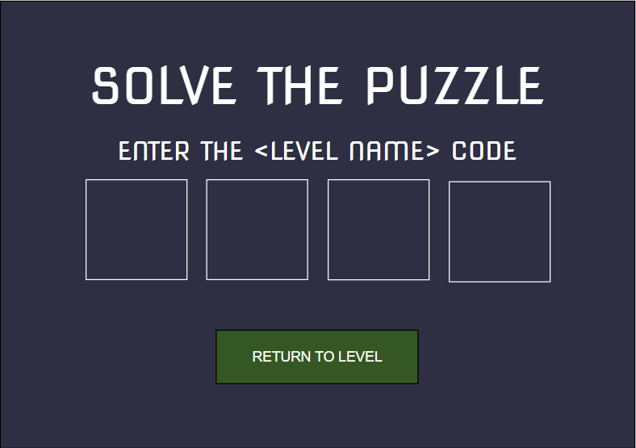

- Game Over    


- Level Complete    
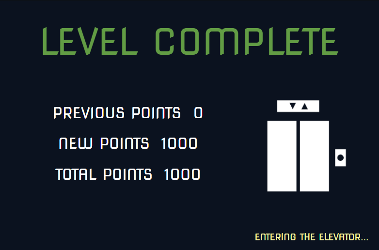

- Elevator - Item Shop    
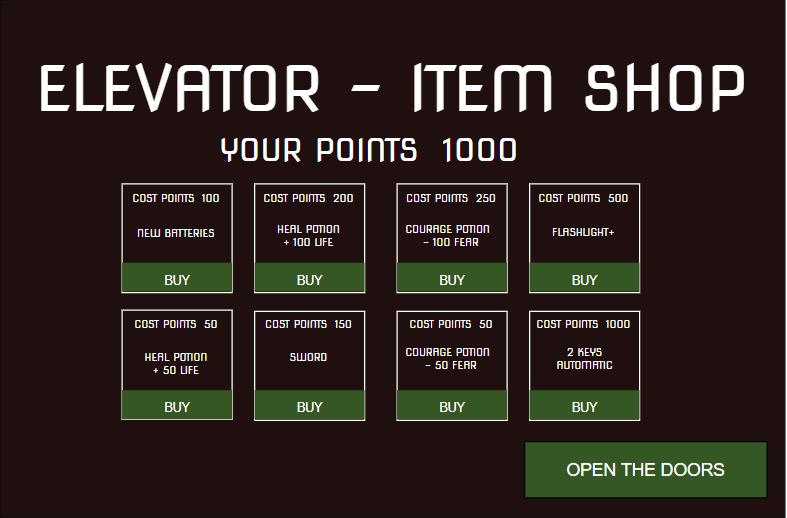

- Patio - Levels Menu     
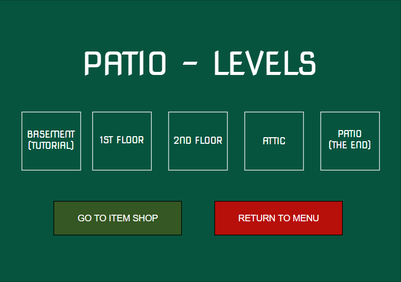

- Game Complete & Credits    
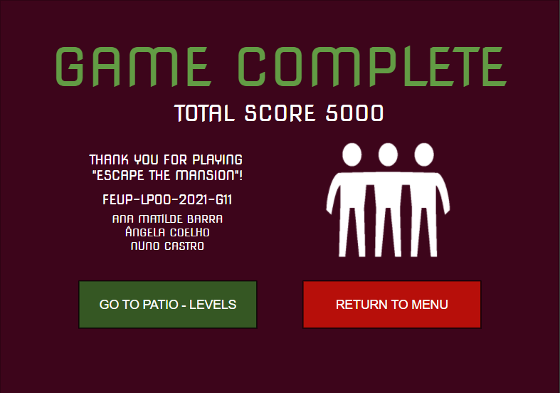

## Design

### Lanterna Facade - Structural Pattern

#### Problem in Context

In this project we are using the Lanterna framework which has lots of features of which we only need a few, e.g. to draw the game elements or the floors. If we used the Laterna's methods directly, the code would be too complex since the classes would become tightly coupled to the implementation details of the framework methods. Therfore, we decided to use the following pattern to avoid this problem.    

#### The Pattern

It was applied the [Facade](https://refactoring.guru/design-patterns/facade) pattern by creating a class with only the relevant features the project development.

#### Implementation

The pattern implementation can be seen in the following image, where the facade is `LanternaGUI`.
  
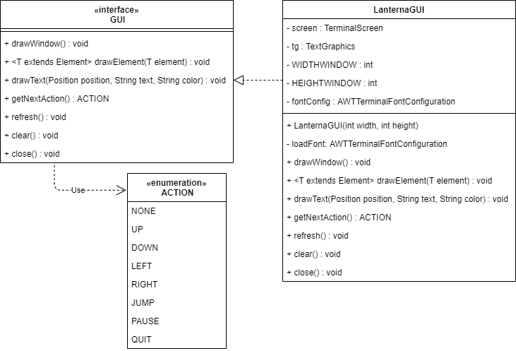

The classes are located in the following files:

- [GUI](https://github.com/FEUP-LPOO-2021/lpoo-2021-g11/blob/main/src/main/java/com/escapethemansion/gui/GUI.java)

- [LanternaGUI](https://github.com/FEUP-LPOO-2021/lpoo-2021-g11/blob/main/src/main/java/com/escapethemansion/gui/LanternaGUI.java)

#### Consequences

By implementing this pattern we are able to isolate our code from the complexity of the Lanterna framework making our code much more straightforward and avoiding too much knowledge about the framework.    

### Model-View-Controller (MVC) - Architectural Pattern

#### Problem in Context

For our project we need to store data for elements, draw them and also have a way to control them. If we only had a single file for each element in our game, the classes would be very large and the code would not be very well organized and separated, making it hard to find eventual bugs or make future updates. In lectures and lab classes we were strongly recommended to start our project with this organization system. Considering all this, we decided to apply the MVC pattern.  

#### The Pattern

We applied the [Model-View-Controller](https://web.fe.up.pt/~arestivo/presentation/patterns/#58) pattern by creating 3 directories that divide the classes in models, views and controllers:
- The 'models' store the data of the elements;
- The 'views' enable the display of the elements and send the user actions for the 'controllers';
- The 'controllers' change the state of the elements by interpreting the user actions sent by the 'views' and provide the 'models' data to the 'views'.

#### Implementation

This pattern implementation can be seen in the following image, that shows our code divided in 4 directories (**model**, **view**, **controller** and gui).

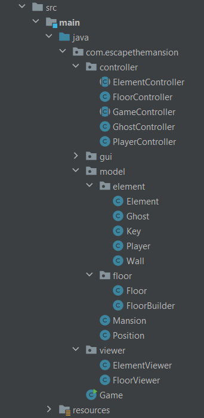

#### Consequences
By implementing this architectural pattern we are able to organize our code in a more useful and logic way, which we believe will save us some troubles in the future.

## Known Code Smells and Refactoring Suggestions

### Switch Statements - SOLVED
  #### Problem

  There is a complex sequence of `if` statements on the processing of Keystrokes in the class `getNextAction()` in [`LanternaGUI`](https://github.com/FEUP-LPOO-2021/lpoo-2021-g11/blob/main/src/main/java/com/escapethemansion/gui/LanternaGUI.java) class.

  ```java
  public ACTION getNextAction() throws IOException {
      KeyStroke keyStroke = screen.readInput();

      if (keyStroke.getKeyType() == KeyType.EOF) return ACTION.QUIT;
      if (keyStroke.getKeyType() == KeyType.Character && toLowerCase(keyStroke.getCharacter()) == 'q') return ACTION.QUIT;

      //Arrows for Movement
      if (keyStroke.getKeyType() == KeyType.ArrowUp) return ACTION.UP;
      if (keyStroke.getKeyType() == KeyType.ArrowRight) return ACTION.RIGHT;
      if (keyStroke.getKeyType() == KeyType.ArrowDown) return ACTION.DOWN;
      if (keyStroke.getKeyType() == KeyType.ArrowLeft) return ACTION.LEFT;

      //WASD for Movement
      if (keyStroke.getKeyType() == KeyType.Character && toLowerCase(keyStroke.getCharacter()) == 'w') return ACTION.UP;
      if (keyStroke.getKeyType() == KeyType.Character && toLowerCase(keyStroke.getCharacter()) == 'd') return ACTION.RIGHT;
      if (keyStroke.getKeyType() == KeyType.Character && toLowerCase(keyStroke.getCharacter()) == 's') return ACTION.DOWN;
      if (keyStroke.getKeyType() == KeyType.Character && toLowerCase(keyStroke.getCharacter()) == 'a') return ACTION.LEFT;

      return ACTION.NONE;
  }
  ```

  #### Refactoring Suggestion

  In this case, we may not get rid of this code smell since the keyboard input must be read and handle accordingly to the relative action and this can't be done any other way if not by using conditional statements.

### Long Method
  #### Problem

  The method `loadMap()` in the class [`FloorBuilder`](https://github.com/FEUP-LPOO-2021/lpoo-2021-g11/blob/main/src/main/java/com/escapethemansion/model/floor/FloorBuilder.java), which is responsible to read a floor map from a text file, contains
  too many lines of code.

  ```java
  public void loadMap(BufferedReader mapReader) throws IOException {
    this.title = loadTitle(mapReader);
    this.offset = loadOffset(mapReader);

    String line;
    int numLine = 0;
    int numCol = 0;

    for(; (line = mapReader.readLine()) != null; numLine++) {
        for(numCol = 0; numCol < line.length(); numCol++) {
            String c = String.valueOf(line.charAt(numCol));
            Position position = this.offset.add(new Position(numCol, numLine));

            switch (c) {
                case "#":
                    this.walls.add(new Wall(position));
                    break;

                case "G":
                    this.ghosts.add(new Ghost(position));
                    break;

                case "X":
                    this.player = new Player(position);
                    break;

                case "K":
                    this.keys.add(new Key(position));
                    break;

                default:
                    break;
            }
        }
    }

    this.width = numCol;
    this.height = numLine;
  
  }
  ```
  
  #### Refactoring Suggestion

  We are still working on this class and this code smell, but the one possible solution would be the [Exctract Method](https://refactoring.guru/extract-method).
  In other words, one way to solve this would be to divide the method into smaller pieces. This would be done by moving parts of the code into separate methods and then replace the old code with calls to these new methods.    

### Large Class

  #### Problem

  Once again, the problem lies in the class [`FloorBuilder`](https://github.com/FEUP-LPOO-2021/lpoo-2021-g11/blob/main/src/main/java/com/escapethemansion/model/floor/FloorBuilder.java) which contains many fields/lines of code. That can be seen just
  by looking at its 9 fields below.
  
  ```java
  private int width;
  private int height;
  private final List<Wall> walls;
  private final List<Ghost> ghosts;
  private final List<Key> keys;
  private Player player;
  private Position offset;
  private String title;
  ```
 
  #### Refactoring Suggestion

  Like it was said before, we are still working on this class. Therefore, we have not already found a solution for this
  code smell, but the [Extract Class](https://refactoring.guru/extract-class) method seems a good way to solve it. This would be done be creating new classes and place the fields and methods responsible for the relevant functionality in it.     

### Duplicate Code

  ## Problem
    
  In class Options Controller - Duplicate code for updating used keys

## Testing

  ### Screenshot of the Gradle test summary  

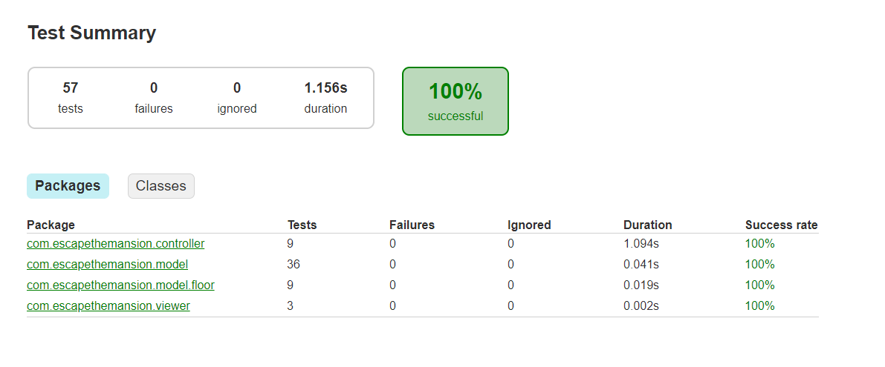
For more detailed information click [here](https://github.com/FEUP-LPOO-2021/lpoo-2021-g11/blob/main/reports/tests/test/index.html) to open the report.


 ### Screenshot of the JaCoCo coverage test summary
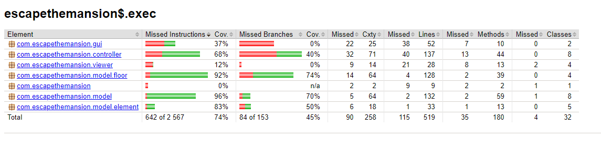
For more detailed information click [here](https://github.com/FEUP-LPOO-2021/lpoo-2021-g11/blob/main/reports/jacoco/index.html) to open the report.

 ### Screenshot of the Pitest mutation test summary
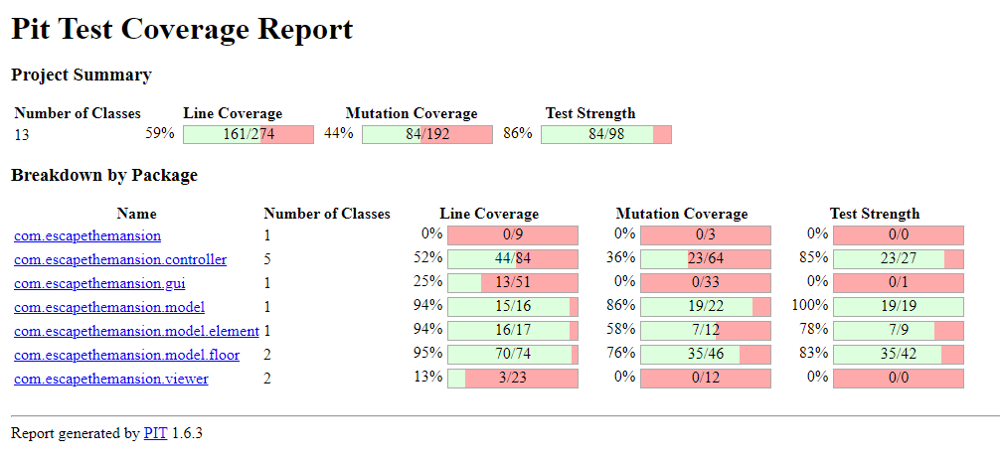
For more detailed information click [here](https://github.com/FEUP-LPOO-2021/lpoo-2021-g11/blob/main/reports/pitest/202105091854/index.html) to open the report.


## Self-Evaluation

| Name                | Number    | Self-Evaluation |
| ------------------- | --------- | --------------- |
| Ana Matilde Barra   | 201904795 |        33,3%    |
| Ângela Coelho       | 201907549 |        33,3%    |
| Nuno Castro         | 202003324 |        33,3%    |


